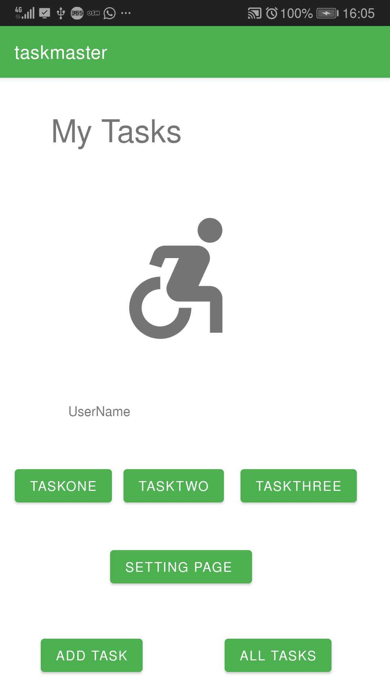
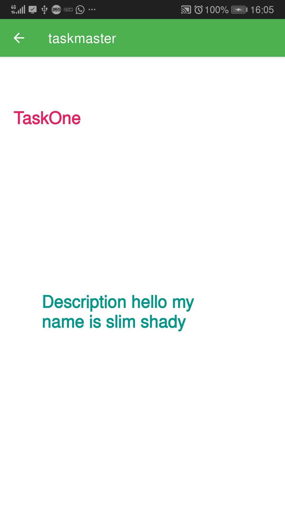
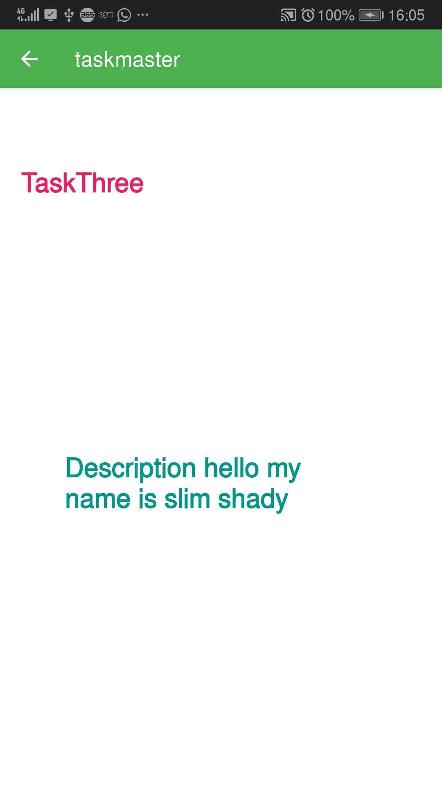
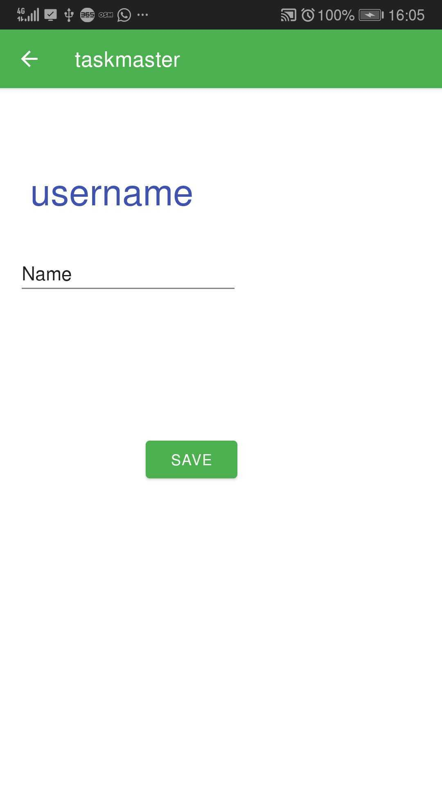
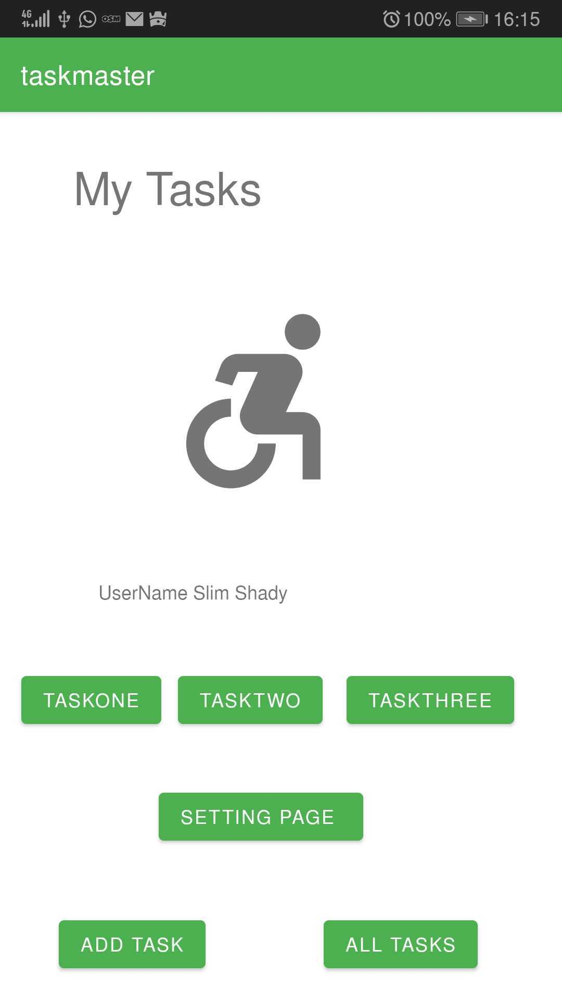

## Adding three buttons in the home page to reach to each task for the user 
## 

## You will pass in the button to the task each task page will have it task
## 
## 
## 

## Adding the settings page in the application
## 
## 
## 

